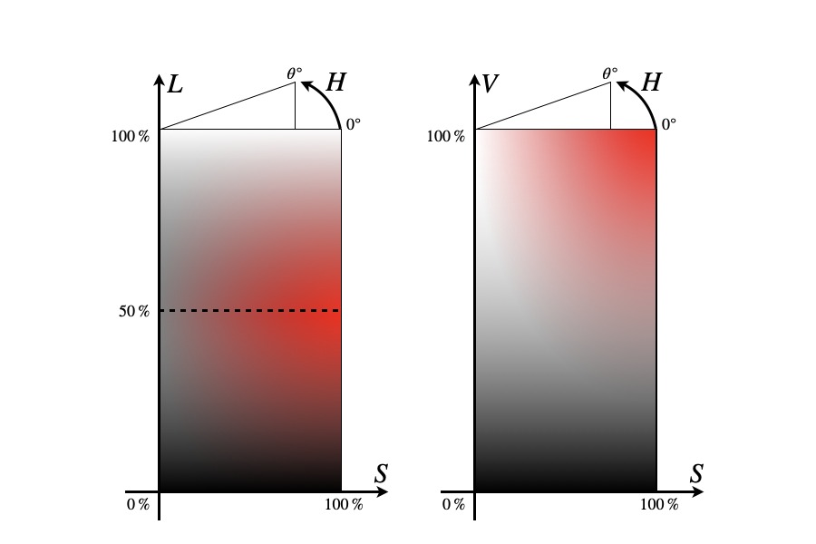

## Color Library

Color Libraryは,色に関する各種機能を提供するJavaScriptライブラリです。Colorオブジェクトを中心に,色の変換や色名値の色データの取得などを行います。

### 使い方
- ダウンロードして使う
    1. [ここをクリック](https://akimikimikimikimikimikimika.github.io/Library/Color/Color.js "Color Library")して,ライブラリをダウンロードする
    2. あなたのWebサイトにライブラリをアップロードして,HTMLに次のコードを追加する
```HTML
    <script src="ライブラリのURL"></script>
```

### 色の基本
- RGB
    コンピュータでは光の3原色の赤,緑,青で色を表現する。各色の強さを調節して,混ぜ合わせることで,人間が視覚で捉えられる全ての色が表現できる。R,G,Bそれぞれに0\~255の256段階あるのが普通。Color Libraryもこれに準ずる。
- HSL
    色の3要素の色相(Hue),彩度(Saturation),明度(Lightness)による表現方法。色相の違いはColorを参照されたい。色相は一般的に度数法で表される。彩度は,0%が無彩色で,100%が鮮やかな色となる。明度は,0%が黒,50%が灰色/純色,100%が白となる。以下の図を参照されたい。色立体において,HSLは円柱座標系を用いるが,θ=0平面に関しては,示された。HSLに似たHSVに関しても以下の図で示されている。
    

### 基本
- `Color()`でColorオブジェクトを生成
- Colorオブジェクトでは,赤,緑,青,透明度の4つのチャンネル(RGBA)で色を管理します
- `color.Hex`により,色の16進数表記をします
- `color.RGB`により,RGB形式で色を表示します
    e.g. `rgb(218,112,214)`の形式で出力し,この場合は,R=218,G=112,B=214を表します。
- `color.HSL`により,HSL形式(色相,彩度,明度)で色を表示します
    e.g. `hsl(302,59%,65%)`の形式で出力し,この場合は,H=302°,S=59%,L=65%を表します。

### 例
```JavaScript
c=Color(); // Colorオブジェクトを生成し,変数cにオブジェクトを代入します
c=Color(240,230,150); // R,G,Bの順に色を指定してColorオブジェクトを生成することもできます
c=Color.Khaki // “Khaki”のような特定の色名の色も生成します
c.RGB; // “rgb(240,230,150)”の形式で色を出力します
c.R=255; // 色cのR成分を255に変更します
c.r(255); // この書き方でもR成分を変更できます
c.r(30).g(144).b(255); // これを組み合わせて,まとめて変更することもできます。
c.HSL; // “hsl(210,100%,56%)”の形式で色を出力します。
c.Hex; // “#1e90ff”の形式で色を出力します。
c.name; // 色名を指定して色を生成した場合,“DodgerBlue”のような色名を表示します。
c2=c(); // 色cをコピーしてc2に代入します。この場合,c2を変更しても,cは変更されません。逆も同様です。
c3=Color.random; // ランダムに色を生成してc3に代入します。
```

### さらに使う
- [色の扱い方](https://akimikimikimikimikimikimika.github.io/Library/Color/Property/ "色の扱い方") (Colorオブジェクトのプロパティ)
- [色の作り方](https://akimikimikimikimikimikimika.github.io/Library/Color/Constructor/ "色の作り方") (`Color()` コンストラクタのパラメータ)
- [色名ガイド](https://akimikimikimikimikimikimika.github.io/Library/Color/List/ "色名ガイド")